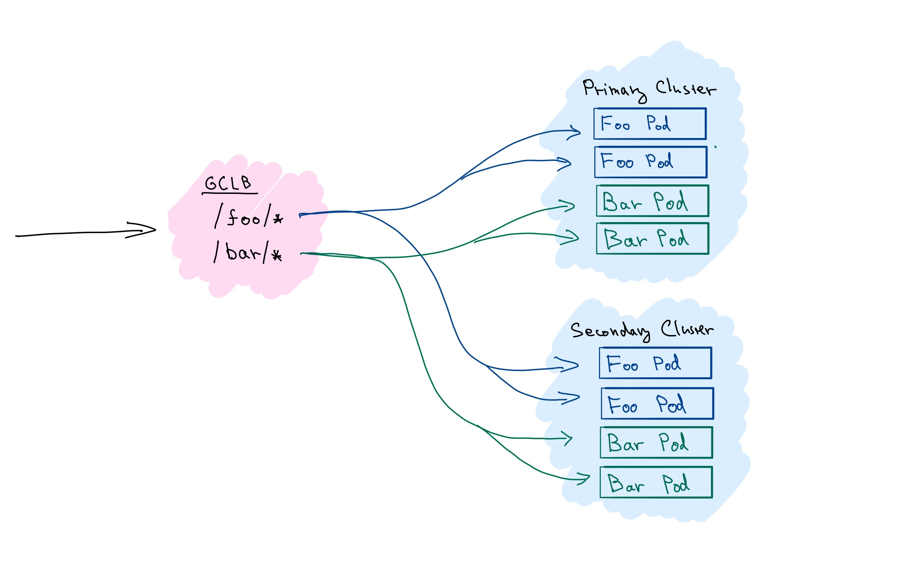

# GKE Multi-Cluster Container-Native Load Balancing

## Prerequisites

- 2 GKE Clusters, in VPC-native mode, let's call them `primary` and `secondary`
- DNS record to point to the static IP
- Recent version of `gcloud` cli

## Architecture

We will setup path based (`/foo`, `/bar`) multi-cluster load balancing for two demo services - Foo and Bar.



## Setup Load Balancing (GCLB) components

- **Point `gcloud` to Your Project**:
  ```
  gcloud config set project [gpc_project_id]
  ```

- **Create Health Check**:
  ```
  gcloud compute health-checks create http health-check-foobar \
    --use-serving-port \
    --request-path="/healthz"
  ```

- **Create Backend Services**
  
  Create backend service for each of the services, plus one more to serve as default backend for traffic that doesn't match the path-based rules.
  
  ```
  gcloud compute backend-services create backend-service-default \
    --global

  gcloud compute backend-services create backend-service-foo \
    --global \
    --health-checks health-check-foobar

  gcloud compute backend-services create backend-service-bar \
    --global \
    --health-checks health-check-foobar
  ```

- **Create URL Map**:
  ```
  gcloud compute url-maps create foobar-url-map \
    --global \
    --default-service backend-service-default
  ```

- **Add Path Rules to URL Map**:
  ```
  gcloud compute url-maps add-path-matcher foobar-url-map \
    --global \
    --path-matcher-name=foo-bar-matcher \
    --default-service=backend-service-default \
    --backend-service-path-rules='/foo/*=backend-service-foo,/bar/*=backend-service-bar'
  ```

- **Reserve Static IP Address**:
  ```
  gcloud compute addresses create foobar-ipv4 \
    --ip-version=IPV4 \
    --global
  ```

- **Create Managed SSL Certificate**:
  ```
  gcloud beta compute ssl-certificates create foobar-cert \ 
    --domains foobar.[your_domain_name]
  ```

- **Create Target HTTPS Proxy**:
  ```
  gcloud compute target-https-proxies create foobar-https-proxy \
    --ssl-certificates=foobar-cert \
    --url-map=foobar-url-map
  ```

- **Create Forwarding Rule**:
  ```
  gcloud compute forwarding-rules create foobar-fw-rule \
    --target-https-proxy=foobar-https-proxy \
    --global \
    --ports=443 \
    --address=foobar-ipv4
  ```

- **Setup DNS**:

  Point your DNS to the previously reserved static IP address. 
  Note the IP address of your forwarding rule:
  ```
  gcloud compute forwarding-rules list
  ```
  Create an A record `foobar.[your_domain_name]` pointing to this IP.

- **Verify TLS Certificate**:

  The whole process of certificate provisioning can take a while. You can verify its status using the:
  ```
  gcloud beta compute ssl-certificates describe foobar-cert
  ```
  The managed.status should become ACTIVE within the next 60m or so, usually sooner, if everything was setup correctly.

## Deploy Services to the GKE Clusters

  Repeat following steps for **each** of your clusters.

- **Get Credentials for kubectl**:
  ```
  gcloud container clusters get-credentials [cluster] \
    --region [cluster-region]
  ```

- **Deploy Both Foo & Bar Applications**:

  We're going to use simple web app that displays basic information about Pod serving the traffic [k8s-demo-app][1]

  [1]: https://github.com/stepanstipl/k8s-demo-app

  ```
  kubectl apply -f deploy-foo.yaml
  kubectl apply -f deploy-bar.yaml
  ```
  You can verify that Pods for both services are up and running by `kubectl get pods`.

- **Create K8s Services for Both Applciations**:
  ```
  kubectl apply -f svc-foo.yaml
  kubectl apply -f svc-bar.yaml
  ```
  You can verify services are setup correctly by forwarding local port using the `kubectl port-forward  service/foo 8888:80` and accessing the service at `http://localhost:8888/`.

Now repeat the above for all your clusters.

## Connect K8s Services to the Load Balancer

GKE has provisioned NEGs for each of the K8s services deployed with the `cloud.google.com/neg` annotation. Now we need to add these NEGs as backends to corresponding backend services.

- **Retrieve Names of Provisioned NEGs**:
  ```
  kubectl get svc \
    -o custom-columns='NAME:.metadata.name,NEG:.metadata.annotations.cloud\.google\.com/neg-status'
  ```
  Note down the NEG name and zones for each service.

  Repeat for all of your GKE Clusters.

- **Add NEGs to Backend Services**:

  Repeat following for every NEG and zone from both clusters:
  ```
  gcloud compute backend-services add-backend backend-service-foo \
   --global \
   --network-endpoint-group [neg_name] \
   --network-endpoint-group-zone=[neg_zone] \
   --balancing-mode=RATE \
   --max-rate-per-endpoint=100
  ```

  And same for Bar service, again repeat for both clusters, every NEG and zone:
  ```
  gcloud compute backend-services add-backend backend-service-bar \
   --global \
   --network-endpoint-group [neg_name] \
   --network-endpoint-group-zone=[neg_zone] \
   --balancing-mode=RATE \
   --max-rate-per-endpoint=100
  ```
 
- **Allow GCLB Traffic**:
  ```
  gcloud compute firewall-rules create fw-allow-health-check \
    --network=[vpc_name] \
    --action=allow \
    --direction=ingress \
    --source-ranges=130.211.0.0/22,35.191.0.0/16 \
    --rules=tcp:8080
  ```
  This rule will allow traffic from GCLB to our pods. `130.211.0.0/22` and `35.191.0.0/16` are source ranges for GCLB traffic as seen by backends (Note: this traffic is internal, therefore you GKE Nodes do not need external IPs).

- **Verify Backends Are Healthy**:
  ```
  gcloud compute backend-services get-health --global backend-service-foo
  gcloud compute backend-services get-health --global backend-service-bar
  ```
  Yous should see 6 backends (3 per cluster, 1 per each zone) for each backend service, with `healthState: HEALTHY`.

## Test Everything's Working

Curl your DNS name `https://foobar.[your-domain]` (or open in the browser). You should get 502 for the root, as we didn't add any backends for the default service.
```
curl -v "https://foobar.[your-domain]"
```

Now curl paths for individual services `https://foobar.[your-domain]/foo/` or `https://foobar.[your-domain]/bar/` and you should receive `200` and content from the corresponding service.

```
curl -v "https://foobar.[your-domain]/foo/"
curl -v "https://foobar.[your-domain]/bar/"
```

If you retry several times, you should see traffic being served by different Pods and Clusters. *Note: if you have clusters in different regions, GCLB will prefer to serve the traffic from the one closer to the client, so do not expect traffic to be load-balanced equally between regions.*

## (optional) `gke-autoneg-controller`

Notice the `anthos.cft.dev/autoneg` annotation on the K8s Services you have previously created. You can deploy [gke-autoneg-controller][1] to your cluster, and use it to automatically associate NEGs created by GKE with corresponding backend services. This will save you some tedious manual work.

Follow the [Installation][2] section in [gke-autoneg-controller][1] README to deploy the controller. 

[1]: https://github.com/GoogleCloudPlatform/gke-autoneg-controller
[2]: https://github.com/GoogleCloudPlatform/gke-autoneg-controller#installation
